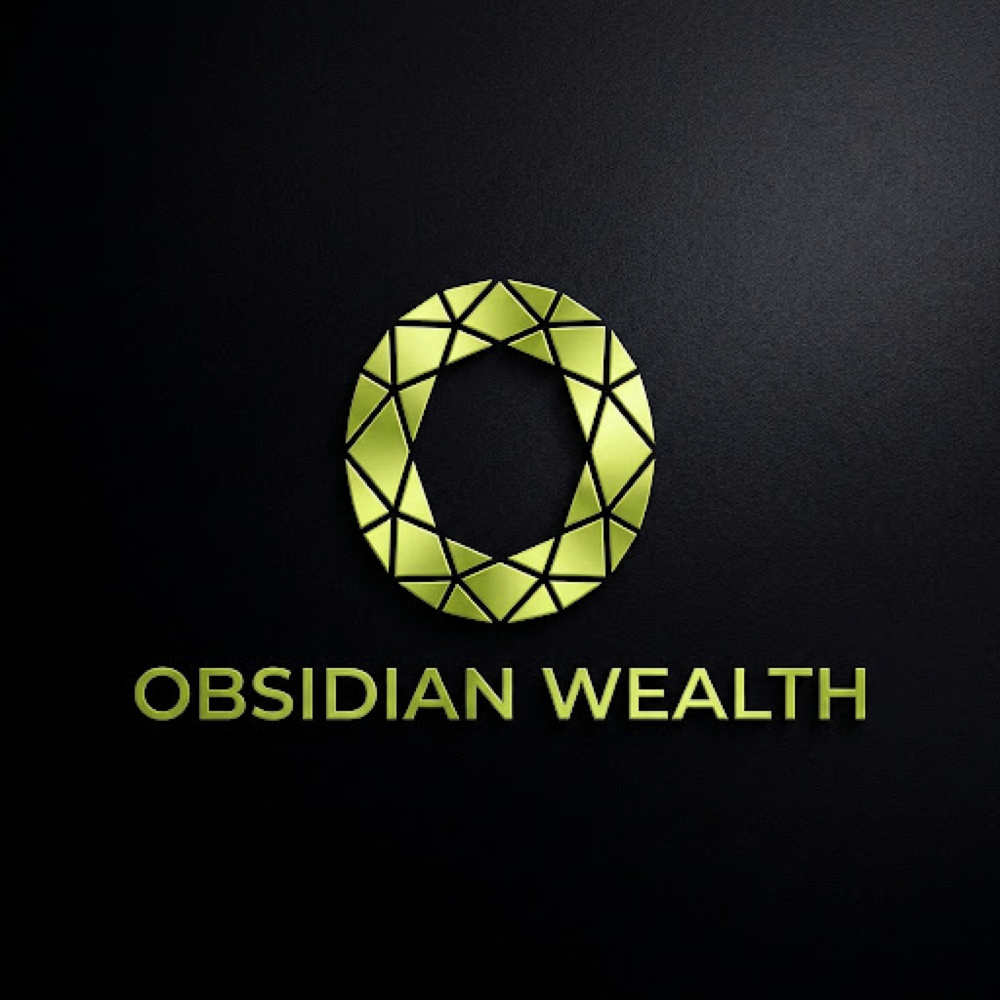

<div align="center">



# 💎 OBSIDIAN WEALTH
### *Sovereign Neo-Bank & Private Wealth Management*

[](https://flutter.dev)
[](https://dart.dev)
[](https://github.com/prajay7/luxury_neo_bank_app)
[](LICENSE)

*An ultra-luxury, futuristic fintech & wealth governance mobile application engineered in Flutter with zero external UI packages.*

---

</div>

## ✨ Key Design Principles

- **Pure Dark Luxury**: Matte `#08090C` obsidian base with `#10131B` glassmorphic cards and brushed titanium accents.
- **Electric Neon Highlights**: Energetic `#D2FF00` (*Electric Lime*) and `#9D00FF` (*Electric Violet*) luminescence.
- **Micro-Interactions & Physics**: Gyroscopic 3D card tilt with specular glare, interactive cubic-Bezier graphs, particle bursts, and smooth scale transitions.
- **Zero Third-Party UI Bloat**: 100% custom-painted Canvas widgets, native `Matrix4` 3D transforms, and custom animation controllers.

---

## 📱 Feature Showcase

<table width="100%">
  <tr>
    <td width="50%" valign="top">
      <h3>🏛️ 1. Wealth Overview Dashboard</h3>
      <ul>
        <li><b>Hero Net Worth Counter</b>: Animated count-up valuation (<code>$2,485,920.00</code>) with radial aura and monthly gain badges.</li>
        <li><b>Obsidian Black Card</b>: Brushed obsidian metal finish with gold EMV chip, contactless insignia, and embossed VIP tier.</li>
        <li><b>Interactive Spline Chart</b>: Custom cubic Bezier performance graph with touch-scrubbing point inspection.</li>
        <li><b>High-Roller Ledger</b>: Real-time VIP transaction history with status indicators and interactive details.</li>
      </ul>
    </td>
    <td width="50%" valign="top">
      <h3>💳 2. 3D Interactive Card Studio</h3>
      <ul>
        <li><b>Matrix4 Gyroscopic Tilt</b>: Drag across the physical card to tilt along X and Y axes with dynamic specular light sheen.</li>
        <li><b>180° Flip Interaction</b>: Flips between Front (chip, logo, cardholder) and Back (magnetic stripe, CVV 892, signature panel).</li>
        <li><b>Dynamic Frost / Freeze</b>: Instantly morphs the card into a frosted cyan cryogenic texture and locks actions.</li>
        <li><b>Spending Governance</b>: Interactive slider for daily limits up to $25,000/day + instant security toggles.</li>
      </ul>
    </td>
  </tr>
  <tr>
    <td width="50%" valign="top">
      <h3>📊 3. Asset Allocation & Analytics</h3>
      <ul>
        <li><b>Interactive Segmented Donut</b>: Custom-painted multi-arc donut chart with tap-to-inspect asset breakdowns (Equities, Bonds, Crypto, Alternatives).</li>
        <li><b>Timeframe Filtering</b>: Seamless switching between <code>1W</code>, <code>1M</code>, <code>3M</code>, <code>1Y</code>, and <code>ALL</code>.</li>
        <li><b>Metric KPIs</b>: Realized Gains, Unrealized Gains, and APR Yield analytics.</li>
      </ul>
    </td>
    <td width="50%" valign="top">
      <h3>⚡ 4. Instant Sovereign Transfers</h3>
      <ul>
        <li><b>VIP Recipient Carousel</b>: Rapid peer selection with avatar badges and direct account links.</li>
        <li><b>Interactive "Slide to Send"</b>: Draggable thumb with spring resistance, state morphing (Sending → Sent), and celebratory <b>physics particle burst</b>.</li>
        <li><b>Cryptographic Proof</b>: Instant transaction hash verification (<code>0x89d2...e482</code>).</li>
      </ul>
    </td>
  </tr>
</table>

---

## 🌟 Visual Identity & Launcher Suites

- **Official Brand Emblem**: Geometric faceted golden-lime diamond oval **"O"** crest embossed over matte brushed obsidian texture.
- **Cinematic Splash Screen**:
  - Encrypted progress bar cycling from *Electric Violet* to *Electric Lime*.
  - Multi-stage security sequence:
    1. `ENCRYPTED SESSION INITIALIZING...`
    2. `ESTABLISHING QUANTUM CIPHER...`
    3. `BIOMETRIC HANDSHAKE VERIFIED`
  - Breathing neon glow halo with haptic transition to main shell.
- **Multi-Resolution Icons**:
  - **iOS**: Full 16-variant `@1x`, `@2x`, `@3x` suite in `ios/Runner/Assets.xcassets/AppIcon.appiconset/`.
  - **Android**: Full launcher mipmap densities (`mdpi`, `hdpi`, `xhdpi`, `xxhdpi`, `xxxhdpi`).

---

## 🏗️ Architecture & Code Organization

```
lib/
├── core/
│   ├── theme/
│   │   ├── obsidian_colors.dart       # Deep Obsidian, Electric Lime & Violet palette
│   │   ├── obsidian_typography.dart   # Stat-driven scales & tracking
│   │   └── obsidian_theme.dart        # Flutter ThemeData for luxury dark mode
│   └── utils/
│       └── formatters.dart            # Currency & compact financial formatters
├── design_system/
│   ├── glass_surface.dart             # Frosted glass with BackdropFilter & highlight borders
│   ├── buttons.dart                   # Primary glow button, GlassButton, TimeframeSelector
│   ├── metric_card.dart               # KPI metric cards with directional trend indicators
│   ├── section_header.dart            # Standardized uppercase section titles with action links
│   ├── snack_bar.dart                 # Floating calibrated luxury feedback SnackBar
│   └── floating_nav_bar.dart          # Floating glass pill navbar with animated active indicators
├── widgets/
│   ├── virtual_card/
│   │   ├── virtual_bank_card.dart     # Physical brushed-metal card (EMV, NFC, CVV)
│   │   └── card_tilt_view.dart        # Matrix4 3D tilt on drag & 180° flip animation
│   ├── charts/
│   │   ├── portfolio_spline_chart.dart# Cubic Bezier spline with gradient fill & touch scrubber
│   │   └── portfolio_donut_chart.dart # Segmented asset allocation donut with tap-to-inspect
│   ├── transfer/
│   │   ├── slide_to_send.dart         # Interactive slide-to-send control with state morphing
│   │   ├── particle_burst.dart        # Physics confetti/particle explosion on completion
│   │   └── quick_transfer_sheet.dart  # Glass modal bottom sheet for instant transfers
│   └── dashboard/
│       ├── balance_display.dart       # Hero net worth display with animated counter
│       └── transaction_row.dart       # High-roller transaction items with status and custom icons
├── screens/
│   ├── splash_screen.dart             # Cinematic brand splash with quantum cipher loader
│   ├── dashboard_screen.dart          # Screen 1: Wealth Overview & Quick Actions
│   ├── card_studio_screen.dart        # Screen 2: 3D Interactive Card Studio
│   ├── analytics_screen.dart          # Screen 3: Portfolio Performance & Asset Breakdown
│   ├── profile_screen.dart            # Screen 4: Sovereign VIP Profile & Concierge
│   └── main_navigation_shell.dart     # Root navigation shell managing floating bottom bar
└── main.dart                          # App entry point
```

---

## 🚀 Getting Started

### Prerequisites
- [Flutter SDK](https://flutter.dev/docs/get-started/install) (v3.27.0 or newer)
- Xcode (for iOS Simulator / device testing)
- Android Studio (for Android Emulator / device testing)

### Installation & Run

1. **Clone the repository**:
   ```bash
   git clone https://github.com/prajay7/luxury_neo_bank_app.git
   cd luxury_neo_bank_app
   ```

2. **Fetch dependencies**:
   ```bash
   flutter pub get
   ```

3. **Launch the application**:
   ```bash
   # Run on iOS Simulator or connected device
   flutter run
   ```

4. **Run Unit & Widget Tests**:
   ```bash
   flutter test
   ```

---

## 🎨 Color Palette & Design Tokens

| Token | Hex Code | Preview | Purpose |
| :--- | :--- | :--- | :--- |
| `obsidianBase` | `#08090C` | `■` | Primary app background |
| `obsidianSurface` | `#10131B` | `■` | Glassmorphic card surfaces |
| `obsidianElevated` | `#181C26` | `■` | Elevated modal dialogs & sheets |
| `electricLime` | `#D2FF00` | `■` | Primary brand accent & positive yields |
| `electricViolet` | `#9D00FF` | `■` | Secondary ambient neon highlights |
| `titaniumPure` | `#FFFFFF` | `■` | Primary headers & valuations |
| `titaniumMid` | `#9AA0AE` | `■` | Body copy & secondary metrics |
| `glassStroke` | `rgba(255,255,255,0.08)` | `□` | Specular glass borders |

---

## 📄 License

This project is licensed under the MIT License - see the [LICENSE](LICENSE) file for details.
